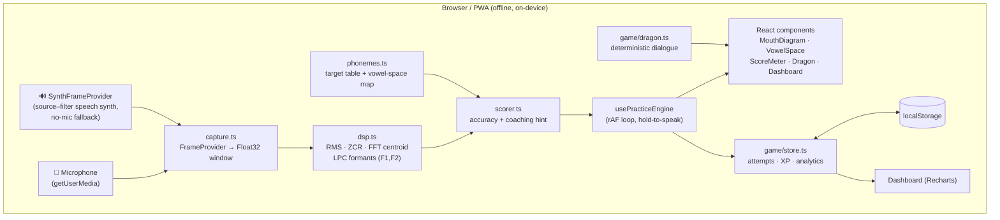

# Architecture — PhonicsForge

## 1. System overview

PhonicsForge is a **100% client-side PWA**. There is no backend, no database
server, and no network dependency at runtime. Everything — microphone capture,
signal processing, scoring, game state, and the dashboard — runs in the browser.
That is a deliberate consequence of the target (a cheap, possibly-offline Fire
tablet in a Title I classroom) and the constraint (kids' audio must not leave the
device — see the COPPA note in RESEARCH.md).



**One-sentence data flow:** raw mic samples → `AcousticFrame` (features) →
`ScoreResult` (accuracy + hint) → drives the visuals and, on release, an
`Attempt` persisted to the store, which the dashboard aggregates.

## 2. Module map

| Path | Responsibility |
|------|----------------|
| `src/audio/capture.ts` | `FrameProvider` interface; `MicFrameProvider` (Web Audio) and `SynthFrameProvider` (fallback source–filter synth). |
| `src/audio/dsp.ts` | Pure DSP: RMS, ZCR, FFT spectral centroid, LPC formant estimation (Levinson–Durbin). |
| `src/audio/phonemes.ts` | The target sound catalogue + the formant↔vowel-space mapping. |
| `src/audio/scorer.ts` | Compares a frame to a target → `accuracy` + `hint`. |
| `src/audio/usePracticeEngine.ts` | React hook: the real-time loop + hold-to-speak state machine. |
| `src/game/store.ts` | External store (localStorage); XP/levels; analytics selectors. |
| `src/game/seed.ts` | Deterministic 14-day seed history. |
| `src/game/dragon.ts` | Sparky's deterministic encouragement engine. |
| `src/components/*` | The view layer (MouthDiagram, VowelSpace, ScoreMeter, Dragon, SoundPicker, MicCoach, Dashboard). |
| `src/lib/*` | Shared types, colours, session constant. |

## 3. Data model (entities)

There are no SQL tables — state is a small JSON document in `localStorage`
(`phonicsforge.v1`). The logical entities:

```ts
Phoneme   { id, ipa, grapheme, label, exampleWord, emoji, mode,
            f1, f2, centroidTarget?, tongueHeight, tongueFront,
            lipRounding, jawOpen }     // static catalogue (phonemes.ts)

Attempt   { phonemeId, score: 0..100, at: epochMs }   // one practice rep

SaveData  { attempts: Attempt[], xp: number }         // the persisted document
```

Derived (computed on read, never stored):
`Mastery` (per-phoneme avg/latest), `dailySeries` (trend), `sessionDelta`
(before→after this session).

## 4. Key flows

**Practice loop (per animation frame):**
1. `usePracticeEngine` reads a window from the active `FrameProvider`.
2. `analyzeFrame` → `AcousticFrame` (formants etc.).
3. `scoreFrame(frame, target)` → `ScoreResult`.
4. Smoothed accuracy drives the meter, the live tongue colour, and the
   vowel-space marker.
5. While "holding", the best smoothed accuracy is tracked.

**On release:** if a real vocalisation occurred, `gameStore.recordAttempt`
persists an `Attempt`, awards XP, maybe levels up, and Sparky reacts via
`dragon.ts`.

**Dashboard:** subscribes to the store and recomputes `masteryByPhoneme`,
`dailySeries`, and `sessionDelta` (the before→after outcome) with `useMemo`.

## 5. The DSP, concretely

The formant estimator is the technical core and is worth understanding for code
review:

1. **Pre-emphasis** (`y[n]=x[n]−0.97x[n−1]`) flattens spectral tilt.
2. **Decimate** to ~8 kHz (vowel formants live below 3 kHz) with a moving-average
   anti-alias.
3. **Hamming window** → **autocorrelation** `r[0..p]`.
4. **Levinson–Durbin** solves for the all-pole LPC coefficients `A(z)`.
5. **Peak-pick** the LPC spectral envelope `1/|A(e^jw)|`; the lowest two peaks are
   F1 and F2.
6. F1↔mouth openness, F2↔tongue frontness → both the **score** (distance to the
   target in vowel space) and the **mouth diagram** (where to put the tongue).

Sibilants (/s/, /ʃ/) are scored on **spectral centroid** (an FFT) plus a
zero-crossing-rate gate, since they have no clear formant structure.

**Noise robustness.** Energy alone is a poor "is someone talking?" signal —
background noise has energy too, and feeding it to the LPC step yields spurious
formants that jump around (and could be rewarded by chance). So a frame must
also be **periodic** to count as a voiced vowel: dsp.ts computes a voicing
confidence (the normalized autocorrelation peak in the 70–400 Hz pitch range),
and the scorer rejects anything below threshold. White noise at full speech
loudness scores **0**. On top of that, `usePracticeEngine` learns the room's
noise floor while idle, requires energy clearly above it, and only awards an
attempt after a **sustained run** of voiced frames — so silence and stray noise
never earn XP, and the live score stops twitching. The browser's own
`noiseSuppression` is also enabled at the mic.

## 6. What's real vs. stubbed/seeded in the MVP

| Area | MVP | Production path |
|------|-----|-----------------|
| Acoustic analysis | **Real** — live LPC formants + FFT centroid, on-device | Add a fine-tuned **wav2vec2** phoneme model (ONNX/WebGPU) for consonant clusters & connected speech; keep LPC as the fast/offline tier. |
| No-mic fallback | **Real synth** (source–filter), drives the same pipeline | Pre-recorded child exemplars per phoneme. |
| Phoneme targets | **Real** adult reference formants (Peterson–Barney) | Per-child **calibration** pass (record a few known vowels, fit the speaker's space) to handle children's higher formants. |
| Practice history | **Seeded** (deterministic 14-day history) + live attempts | Real longitudinal data; optional encrypted sync for multi-device. |
| Persistence | `localStorage` | `IndexedDB` (larger quota, structured) — same store interface. |
| Companion dialogue | **Deterministic** templates | Optional on-device small LLM (the brief's Phi-3) for free-form chat. |
| 3D mouth | **Procedural 2D SVG** sagittal section | Optional Three.js blendshape head; the articulation params already exist to drive it. |

## 7. Stack & why

- **Vite + React + TypeScript (strict).** Fast clean-clone start (`npm i && npm run dev`), typed end-to-end, zero config to explain in code review.
- **Hand-written DSP (no audio ML lib).** Keeps the bundle tiny, runs offline on weak hardware, and is genuinely *understandable* — important for the "Quality of Code" rubric line.
- **Recharts** for the dashboard (named in the brief; standard, declarative).
- **vite-plugin-pwa** for installability + offline service worker.
- **localStorage** (not a DB) because the data is tiny and must work offline with no server.

See `DECISIONS.md` for the trade-offs behind each choice, including where this
build deliberately departs from the original brief's stack.
